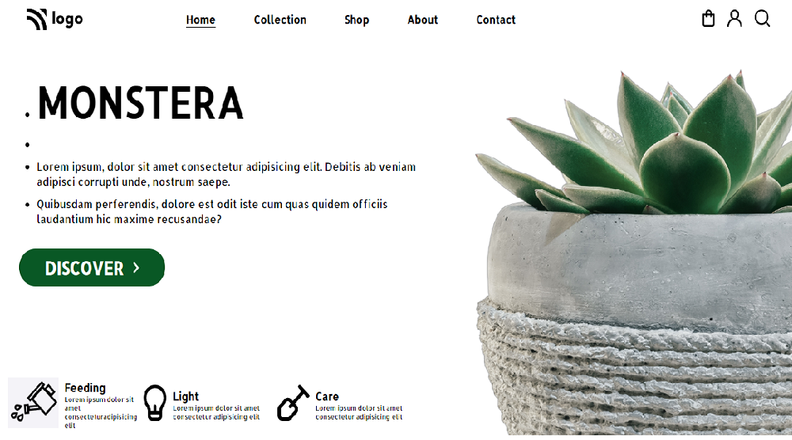

# Live Project 6

 Time taken to complete this project is 1 day

## Concepts Learnt
- position
- selecting elements using Ids
- placing elements in rows and columns

In this project I got some confusions to place items. Then I referred mdn documentation to choose correct ids for placing items perfectly

[netlify link](https://plant-landpage.netlify.app/)

